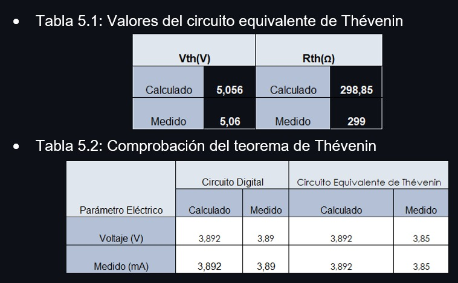

# INFORMELABORATORIO5

## Teorema de Thévenin

1. OBJETIVOS

• Emplear el teorema de Thevenin para representar el circuito mostrado en el laboratorio como un circuito dual o equivalente, empleando una sola fuente de voltaje en serie con una resistencia equivalente. Analizar el circuito, y deducir los errores porcentuales entre el cálculo teórico y práctico, y entre la aplicacion del circuito equivalente de Thevenin y el circuito normal.

• Conocer más a fondo los fundamentos básicos de este teorema y su aplicación en la vida real.

• Encontrar los parametros previos, necesarios para el calculo (Voltaje de thevenin, Resistencia equivalente de thevenin)

• Comprobar experimentalmente que se cumpla el teorema en estudio.

2. MARCO TEÓRICO

3. DIAGRAMAS

Diagrama general (Circuito)

Circuito en tinkercad (medición de voltaje y corriente)

Circuito en tinkercad (medición de voltaje de Thévenin)

Circuito en tinkercad (medición resistecia equivalente de Thévenin)

Circuito equivalente de Thévenin (medición voltaje y corriente)

4. LISTA DE COMPONENTES

| Cantidad  | Elemento  | 
| --------- | --------- | 
| 2 | Fuente de Voltaje de C.D. |
| 2 | Multímetros Digitales |
| 1 | Resistor de 560 Ω |
| 1 | Resistor de 4.7 kΩ |
| 1 | Resistor de 330 Ω |
| 1 | Resistor de 100 Ω |
| 1 | Resistor de 1 kΩ |
| 1 | Potenciómetro de precisión de 1 kΩ |
| 1 | Protoboard |

5. EXPLICACIÓN

Calcule el voltaje y corriente en R5

Resuelvo el sistema de ecuaciones

El voltaje y corriente que pasan por R5

 
 5.1 VIDEO
 
 

6. CONCLUSIONES

• El Teorema de Thévenin tiene como objetivo simplificar los cálculos de un sistema eléctrico complejo por un circuito eléctrico equivalente mucho mas simple, constituido por una fuente de tensión y una resistencia equivalente.

• Esta práctica nos permitió visualizar experimental y matemáticamente como se emplea el Teorema de Thevenin, el cual consiste en que el valor de las resistencias puede ser reemplazada o sustituida por otra fuente de tensión.

• En cuanto a los resultados obtenidos podemos llegar a la conclusión de que se obtuvieron resultados satisfactorios, ya que el porcentaje de error que se obtuvo fue muy bajo de entre 0 y 1 porciento.

7. BIBLIOGRAFÍA

• Floyd Thomas L, “Principios de Circuitos Eléctricos”, 8 ed. 2007 .Pearson Educación de México, S.A. de C.V. México, pp. 281-333.

• Alulema Darwin (2020). Capítulo 3. Teorema de Thevenin. Pags 48-55.

• Teorema de Thévenin. 2017. Ecured. Recuperado de: https://www.ecured.cu/Teorema_de_Thévenin

• Veloso C (2017). TEOREMA DE THÉVENIN – CIRCUITO EQUIVALENTE. Recuperado de https://www.electrontools.com/Home/WP/teorema-de-thevenin-circuito-equivalente/
